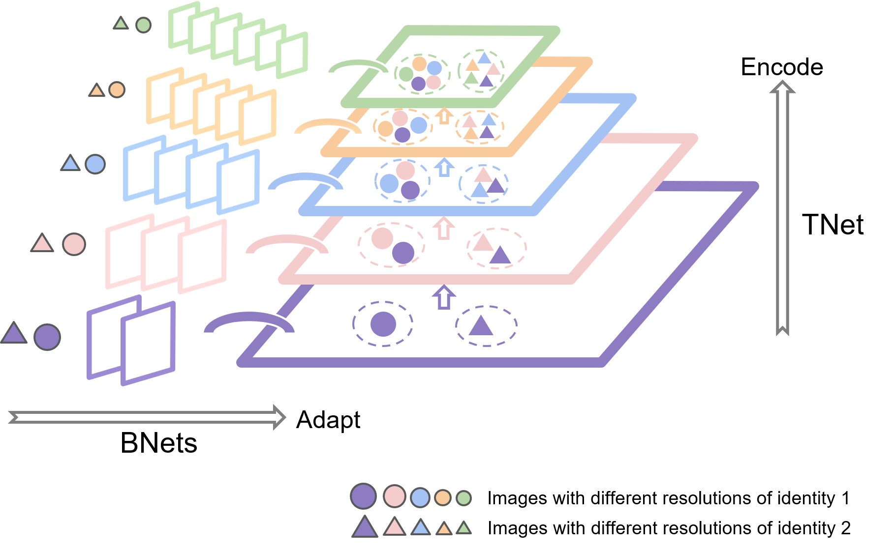

# Learning Unified Representations for Multi-Resolution Face Recognition

This repository is the pytorch implementation of _Learning Unified Representations for Multi-Resolution Face Recognition_ (**accepted by BMVC 2023**).

Branch-to-Trunk network (BTNet) is a representation learning method for multi-resolution face recognition. It consists of a trunk network (TNet), namely a unified encoder, and multiple branch networks (BNets), namely resolution adapters. As per the input, a resolution-specific BNet is used and the output are implanted as feature maps in the feature pyramid of TNet, at a layer with the same resolution.



Our code is based on [InsightFace](https://github.com/deepinsight/insightface/tree/master/recognition/arcface_torch) ,
[CurricularFace](https://github.com/HuangYG123/CurricularFace) and [QMUL-SurvFace-Open-Set-Identification](https://github.com/1ho0jin1/QMUL-SurvFace-Open-Set-Identification/).

## Main Requirements

- [PyTorch](http://pytorch.org) (torch>=1.6.0)
- tensorboard
- easydict
- mxnet
- sklearn
- matplotlib
- opencv-python
- scikit-image

## Prepare Datasets

- [MS1MV3](https://github.com/deepinsight/insightface/tree/master/recognition/_datasets_#ms1m-retinaface) (93k IDs, 5.2M images)
- [IJB-C](https://nigos.nist.gov/datasets/ijbc/) (3,531 IDs, 130k images)
- [QMUL-SurvFace](https://qmul-survface.github.io/) (15,573 IDs, 463.5k images)

## Training

To train BTNet in the paper with 4 GPUs, run the following commands:

### 1. To train the trunk network:

```shell
# Resolution 112
python -m torch.distributed.launch --nproc_per_node=4 --nnodes=1 --node_rank=0 --master_addr="127.0.0.1" --master_port=12581 train_multi_reso.py configs/ms1mv3_r50_reso112
```

### 2. To train the branch networks:

```shell
# Resolution 28
python -m torch.distributed.launch --nproc_per_node=4 --nnodes=1 --node_rank=0 --master_addr="127.0.0.1" --master_port=12581 train_multi_reso_distill.py configs/ms1mv3_r50_reso28
# Resolution 14
python -m torch.distributed.launch --nproc_per_node=4 --nnodes=1 --node_rank=0 --master_addr="127.0.0.1" --master_port=12581 train_multi_reso_distill.py configs/ms1mv3_r50_reso14
# Resolution 7
python -m torch.distributed.launch --nproc_per_node=4 --nnodes=1 --node_rank=0 --master_addr="127.0.0.1" --master_port=12581 train_multi_reso_distill.py configs/ms1mv3_r50_reso7
```

### 3. (Optional) To finetune the trunk network on QMUL-SurvFace:

```shell
# Resolution 112
python -m torch.distributed.launch --nproc_per_node=4 --nnodes=1 --node_rank=0 --master_addr="127.0.0.1" --master_port=12581 train_multi_reso.py configs/surv_r50_reso112
```

### 4. (Optional) To finetune the branch networks on QMUL-SurvFace:

```shell
# Resolution 28
python -m torch.distributed.launch --nproc_per_node=4 --nnodes=1 --node_rank=0 --master_addr="127.0.0.1" --master_port=12581 train_multi_reso_distill.py configs/surv_r50_reso28
# Resolution 14
python -m torch.distributed.launch --nproc_per_node=4 --nnodes=1 --node_rank=0 --master_addr="127.0.0.1" --master_port=12581 train_multi_reso_distill.py configs/surv_r50_reso14
# Resolution 7
python -m torch.distributed.launch --nproc_per_node=4 --nnodes=1 --node_rank=0 --master_addr="127.0.0.1" --master_port=12581 train_multi_reso_distill.py configs/surv_r50_reso7
```

## Evaluation

### 1. Multi-resolution identity matching (pairs <id1, id2>):

To evaluate BTNet on face verification benchmarks, run:

```shell
cd eval
# LFW, CALFW, CPLFW
python verification_multi_reso.py --target 'lfw,calfw,cplfw' --weight1 /path/to/model1 --weight2 /path/to/model2 --reso1 id1_resolution --reso2 id2_resolution --model_reso1 model1_input_resolution --model_reso2 model2_input_resolution --upsample1 0 --upsample2 0
# CFP-FF, CFP-FP, AgeDB_30
python verification_multi_reso.py --target 'cfp_ff,cfp_fp,agedb_30' --weight1 /path/to/model1 --weight2 /path/to/model2 --reso1 id1_resolution --reso2 id2_resolution --model_reso1 model1_input_resolution --model_reso2 model2_input_resolution --upsample1 0 --upsample2 0
```

To evaluate BTNet on QMUL-SurvFace 1:N face identification, run:

```shell
python eval_survface_1n_multi_reso.py --meta_path /path/to/QMUL-SurvFace/dataset --weight112 /path/to/TNet --weight28 /path/to/BNet28 --weight14 /path/to/BNet14 --weight7 /path/to/BNet7 --reso_indicator 'max' --branch_select 'ceil'
```

### 2. Multi-resolution feature aggregation (template <img1, img2>):

To evaluate BTNet on IJB-C 1:1 face verification, run:

```shell
python eval_ijbc_11_multi_reso.py --model-prefix1 /path/to/model1/ --model-prefix2 /path/to/model2 --reso1 img1_resolution --reso2 img2_resolution --model_reso1 model1_input_resolution --model_reso2 model2_input_resolution --upsample1 0 --upsample2 0
```

To evaluate BTNet on IJB-C 1:N face identification, run:

```shell
python eval_ijbc_1n_multi_reso.py --model-prefix1 /path/to/model1/ --model-prefix2 /path/to/model2 --reso1 img1_resolution --reso2 img2_resolution --model_reso1 model1_input_resolution --model_reso2 model2_input_resolution --upsample1 0 --upsample2 0
```

## Pre-trained Models

You can download BTNet pretrained on MS1MV3 here:

- [Baidu Yun Pan](https://pan.baidu.com/s/1jDx3KCmmsT1j-MpNQH6ldQ): lnu4

You can download BTNet finetuned on QMUL-SurvFace here:

- [Baidu Yun Pan](https://pan.baidu.com/s/1gWIgZbnTUcMGNn4g52eM6g): 5z75

##Results
BTNet achieves the following performances:

(a) Face verification benchmarks and IJB-C

| Test setting | Face verification benchmarks | IJB-C 1:1 verification (1e-4) | IJB-C 1:N identification (0.1) |
| :----------- | :--------------------------- | :---------------------------- | :----------------------------- |
| 112&7        | 86.10                        | 88.17                         | 83.93                          |
| 112&14       | 94.08                        | 93.97                         | 91.87                          |
| 112&28       | 96.65                        | 95.62                         | 94.33                          |
| 7&7          | 77.78                        | 35.47                         | 27.70                          |
| 14&14        | 90.90                        | 82.08                         | 76.65                          |
| 28&28        | 96.27                        | 94.50                         | 92.89                          |
| 112&112      | 97.25                        | 96.06                         | 94.85                          |

(b) QUML-SurvFace

| Method     | AUC  | TPIR20(0.3) | TPIR20(0.2) | TPIR20(0.1) | TPIR20(0.01) |
| :--------- | :--- | :---------- | :---------- | ----------- | ------------ |
| avg.+floor | 32.6 | 27.9        | 23.4        | 16.5        | 1.4          |
| avg.+near  | 34.6 | 30.3        | 25.7        | 18.9        | 1.5          |
| avg.+ceil  | 35.4 | 31.1        | 26.8        | 20.3        | 2.2          |
| min+floor  | 32.3 | 27.6        | 23.2        | 16.1        | 1.4          |
| min+near   | 34.0 | 29.6        | 25.0        | 18.0        | 1.4          |
| min+ceil   | 35.3 | 31.0        | 26.6        | 19.9        | 2.0          |
| max+floor  | 33.6 | 29.1        | 24.5        | 17.6        | 1.3          |
| max+near   | 35.2 | 31.0        | 26.4        | 19.6        | 1.7          |
| max+ceil   | 35.4 | 31.2        | 26.9        | 20.6        | 2.5          |

## Contributing
We appreciate all contributions to improve the multi-resolution face recognition model zoo of BTNet.

All content in this repository is licensed under the MIT license.
